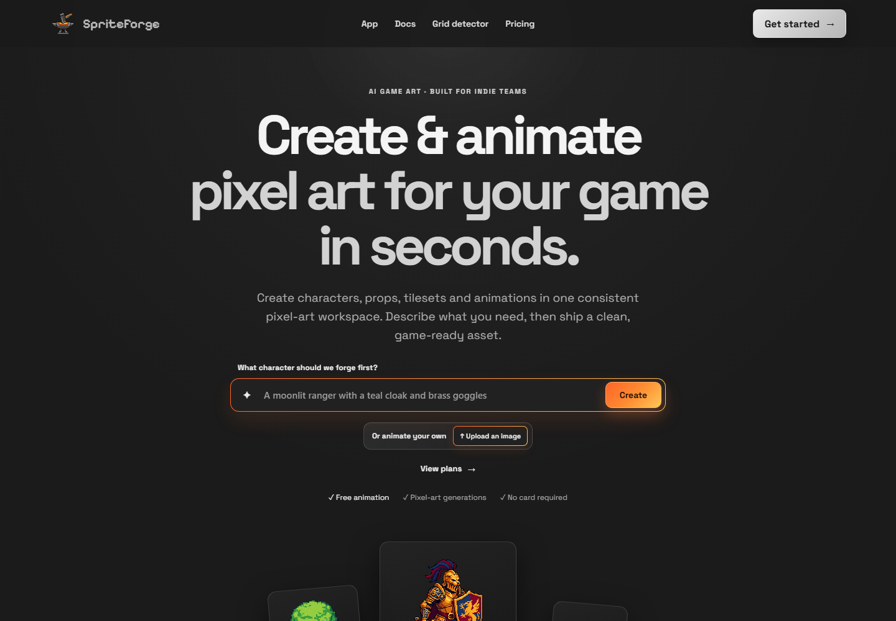
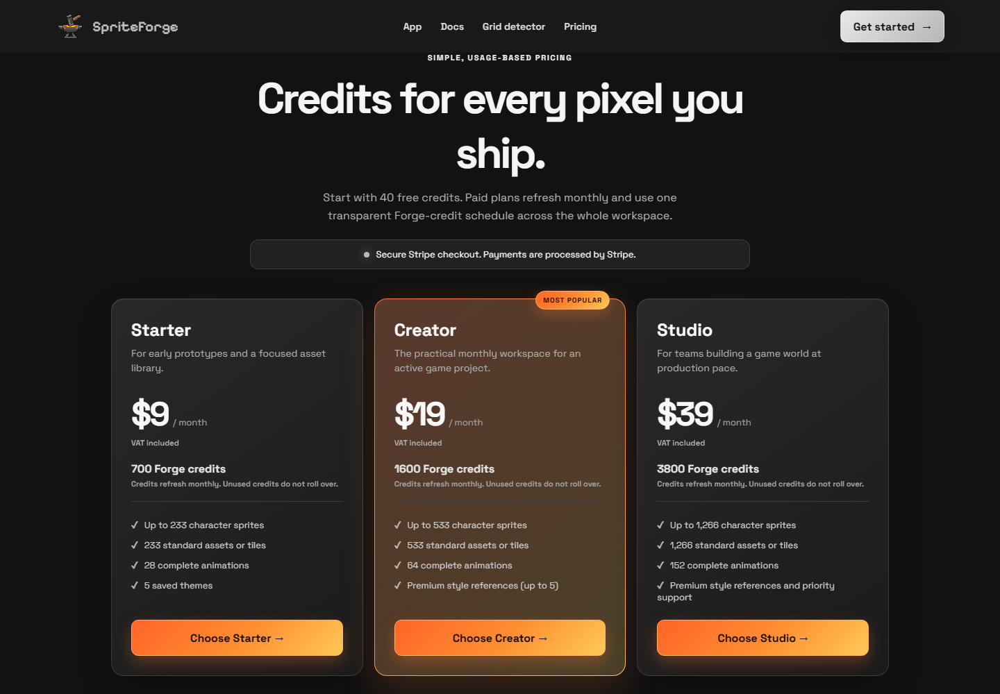
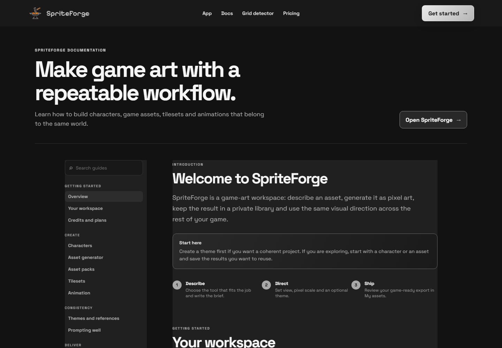

# SpriteForge

[](https://github.com/TitoAdri/spriteforge-visual-server/actions/workflows/ci.yml)

SpriteForge is a pixel-art workspace for game creators. It combines AI-assisted asset generation with a browser-based editor so characters, props, tilesets and animations can be created, refined and exported from one place.

## Product tour

The public product keeps the workflow focused: describe an idea, choose the
right art tool, then refine and ship the result from one private workspace.







These screenshots are captured from the public site and are included as a
visual overview for reviewers. The application continues to evolve separately
from this portfolio repository.

## Highlights

- Character, prop, asset-pack, tileset and animation workflows.
- Frame-by-frame pixel-art editing with a vendored Piskel build.
- Local grid detection, snapping and background cleanup.
- Themes, projects and a private asset library.
- PNG, GIF and spritesheet exports.
- Responsive dark UI designed for desktop and tablet use.

## Repository layout

| Path | Purpose |
| --- | --- |
| `index.html` | Public entry point and metadata. |
| `frontend/` | Browser modules and styles for the landing pages, workspace and generators. |
| `pixel-editor/` | Manual pixel-art editor and its local Piskel runtime. |
| `generator/src/` | Node.js API, authentication, billing, library and image providers. |
| `generator/test/` | Backend tests. |
| `assets/` | Public branding, examples and static resources. |
| `docs/` | Screenshots, research notes, backlog and local evaluation fixtures; not part of the browser bundle. |
| `ops/` | Host-side backup and maintenance helpers. |
| `Dockerfile`, `docker-compose.yml`, `nginx.conf` | Local container setup and secure frontend/API routing. |

The implementation notes for coding agents live in [`AGENTS.md`](AGENTS.md). They describe module boundaries and invariants without including deployment credentials or private server details.

## Run locally

### Requirements

- Docker with Compose, or Node.js 22 for running the API directly.
- An API key only if you want to exercise provider-backed generation. Keep it in a local, ignored `.env` file.

### Docker Compose

```powershell
Copy-Item generator/.env.example generator/.env
# Fill in only the values needed for your local environment.
docker compose up --build
```

The frontend is served by Nginx and the API is available inside the Compose network. For a quick health check:

```powershell
curl http://localhost:3002/health
docker compose ps
```

The API port is intentionally internal to the Compose network. Run the health
check from the API container or publish the port explicitly for local-only
debugging; do not expose it on an internet-facing host.

### Tests

```powershell
node --test generator/test/*.test.mjs
```

## Security and privacy

- Never commit `generator/.env`, SQLite files, `generator/data/`, backups, logs or generated evaluation output.
- Provider keys, OAuth secrets, payment keys and session secrets belong in the deployment secret store, never in frontend code.
- The API performs authentication, CSRF, ownership and credit checks server-side; UI controls are not security boundaries.
- Keep the production data volume separate from the source checkout.
- Before publishing a fork, review image ownership and third-party notices in `pixel-editor/`.

Please report security issues privately rather than opening a public issue containing credentials or exploit details.

## Project status

SpriteForge is a portfolio and product prototype. Provider integrations, billing and deployment configuration may change independently from the frontend. The codebase is intentionally split into a static frontend and a small Node.js API so either side can be developed and tested separately.

## License

Original SpriteForge source code is released under the [MIT License](LICENSE).
Artwork, generated examples and vendored components may have separate terms;
see their accompanying notices, including `pixel-editor/LICENSE`.
